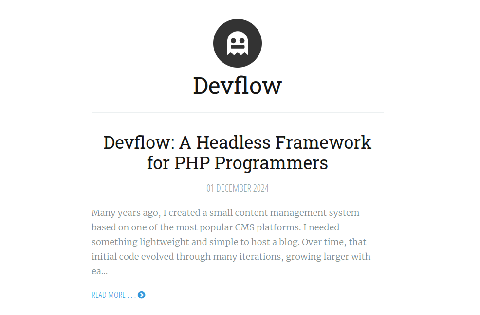

# Vapor
Ported from Ghost, Vapor is a minimal and responsive theme with a focus on typography.

> __Requires__ Devflow Version: 2.x

> __Tested Up To:__ 2.4.0

> __Requires PHP:__ 8.4+

> __Stable Tag:__ 3.0.1

> __License:__ GPLv2-only

## Screenshot


## Localization
Portuguese, Chines (Simplified), German, English, Spanish, French, Italian Japanese, and Russian

## Composer Installation
1. Start a new shell session.
2. In the root of your install, run the following command ```php codex theme:install getdevflow/vapor```.

## Changelog

### 3.0.1
- reverted font awesome version

### 3.0.0
- `pagebuilder.support` filter hook check
- uses new `cms_body_open` action hook

### 2.0.0
- Fixed for Devflow 2.x
- Updated/added locales

### 1.0.0
- Initial addition
